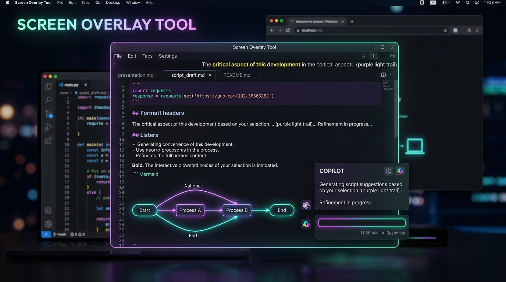
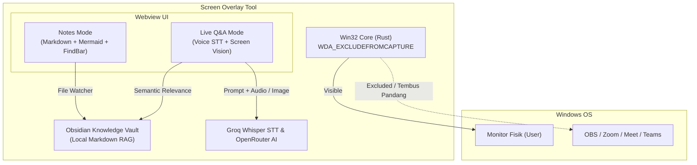

<div align="center">

# 🪟 Screen Overlay Tool
### Stealth Floating Teleprompter & Live AI Copilot for Technical Assessments & Presentations

[](https://github.com/danisetiawan31/overlay-screen-tools/releases)
[](https://github.com/danisetiawan31/overlay-screen-tools/releases)
[](https://tauri.app/)
[](https://www.rust-lang.org/)
[](https://github.com/danisetiawan31/overlay-screen-tools/releases)

<br/>



<br/>
<br/>

**Aplikasi HUD desktop ultra-ringan yang tetap tampil jelas di layar monitor fisik Anda, namun 100% tembus pandang dan tidak pernah terekam oleh software perekam layar (OBS, Zoom, Discord, Google Meet, Microsoft Teams, dsb.).**

[📥 Download Installer (.exe)](#-download--installation) • [✨ Fitur Utama](#-fitur-utama) • [⌨️ Shortcut Cheat-Sheet](#%EF%B8%8F-shortcut-cheat-sheet) • [🏗️ Arsitektur](#%EF%B8%8F-arsitektur--cara-kerja) • [🚀 Quick Start](#-quick-start-development)

</div>

---

## 📥 Download & Installation

Pilih paket instalasi yang paling sesuai untuk sistem Windows Anda:

| Package | Tipe | Ukuran | Link Unduhan |
|---|---|:---:|---|
| **Setup Installer (`.exe`)** | **NSIS Setup (Sangat Disarankan)** | `2.46 MB` | [⬇️ **Download Setup (.exe)**](https://github.com/danisetiawan31/overlay-screen-tools/releases/latest/download/Screen.Overlay.Tool_0.1.0_x64-setup.exe) |
| **Portable Executable (`.exe`)** | **Standalone (Langsung Jalan)** | `4.82 MB` | [⬇️ **Download Portable (.exe)**](https://github.com/danisetiawan31/overlay-screen-tools/releases/latest/download/poc-overlay.exe) |
| **Windows MSI Package (`.msi`)** | **Enterprise / System-wide** | `3.03 MB` | [⬇️ **Download MSI (.msi)**](https://github.com/danisetiawan31/overlay-screen-tools/releases/latest/download/Screen.Overlay.Tool_0.1.0_x64_en-US.msi) |

> 💡 **Bagi Pengembang Lokal**: File binary hasil build sudah tersedia langsung di direktori proyek Anda:
> ```text
> D:\project\poc-overlay\release-build\
> ```

---

## ✨ Fitur Utama

<table>
  <tr>
    <td width="50%">
      <h3>👻 100% Stealth Capture-Exclusion</h3>
      Menggunakan Win32 API <code>WDA_EXCLUDEFROMCAPTURE</code> secara native pada main HWND, seluruh child WebView2 render surfaces, hingga modal file dialog. <b>Tampak jernih di mata Anda, namun gaib di hasil rekaman atau screen sharing.</b>
    </td>
    <td width="50%">
      <h3>📝 Multi-Document Notes & Teleprompter</h3>
      Membuka banyak file catatan Markdown secara tabulasi dengan auto-restore saat dibuka kembali. Dilengkapi live file watcher (auto-reload saat file diedit di Obsidian/VSCode), Scratchpad instan, dan pencarian kata in-app.
    </td>
  </tr>
  <tr>
    <td width="50%">
      <h3>🎙️ Live Q&A Multimodal Copilot</h3>
      Tahan tombol <b>F8</b> untuk Push-to-Talk transkripsi suara instan (Groq Whisper STT) atau tekan <b>F7 / Ctrl+F8</b> untuk analisis tangkapan layar otomatis (Multimodal Vision AI). Jawaban AI disajikan to-the-point dalam hitungan detik.
    </td>
    <td width="50%">
      <h3>🧠 Obsidian Vault Context Injection (RAG)</h3>
      Secara cerdas memindai vault catatan lokal Obsidian Anda dan menyuntikkan konteks profil, portofolio flagship, serta solusi algoritma ke prompt AI dengan persona orang pertama (<em>"Saya"</em>).
    </td>
  </tr>
  <tr>
    <td width="50%">
      <h3>📊 Diagram Mermaid & GitHub Callouts</h3>
      Mendukung render flowchart, sequence diagram, dan arsitektur Mermaid interaktif lengkap dengan kontrol zoom (+/- / mouse wheel) dan pan drag, serta kartu callout GitHub (<code>[!NOTE]</code>, <code>[!TIP]</code>, <code>[!IMPORTANT]</code>, <code>[!WARNING]</code>, <code>[!CAUTION]</code>).
    </td>
    <td width="50%">
      <h3>⚡ Ultra-Ringan & Cepat (~2.4 MB)</h3>
      Ditenagai Rust dan engine WebView2 bawaan Windows. Menghindari beban 150+ MB Chromium bawaan Electron, konsumsi memori RAM sangat rendah (&lt; 50 MB), dan startup instan.
    </td>
  </tr>
</table>

---

## ⌨️ Shortcut Cheat-Sheet

Semua kontrol dirancang untuk dapat diakses instan melalui keyboard tanpa memindahkan fokus dari jendela aktif Anda:

| Shortcut | Aksi | Keterangan |
|---|---|---|
| <kbd>F9</kbd> | **Toggle Overlay (Show / Conceal)** | Menyembunyikan / menampilkan jendela overlay seketika |
| <kbd>F8</kbd> *(Hold)* | **Push-to-Talk Voice Q&A** | Bicara pertanyaan teknis, lepas untuk langsung dijawab AI |
| <kbd>F7</kbd> / <kbd>Ctrl</kbd>+<kbd>F8</kbd> | **Silent Screenshot AI** | Menangkap layar secara senyap dan memecahkan soal/kode |
| <kbd>F6</kbd> | **Toggle Tab (Notes ↔ Q&A)** | Berpindah cepat antara mode catatan dan tanya-jawab AI |
| <kbd>Ctrl</kbd>+<kbd>F10</kbd> | **Cycle Document Tabs** | Berpindah ke tab dokumen berikutnya secara berputar |
| <kbd>Ctrl</kbd>+<kbd>F11</kbd> / <kbd>Ctrl</kbd>+<kbd>F12</kbd> | **Toggle Find Bar** | Membuka bar pencarian teks pada catatan aktif |
| <kbd>Ctrl</kbd> + <kbd>+</kbd> / <kbd>-</kbd> / <kbd>0</kbd> | **Font Size Zoom** | Memperbesar, memperkecil, atau mereset ukuran teks (10–32px) |
| <kbd>Ctrl</kbd> + <kbd>Wheel</kbd> | **Mouse Wheel Font Zoom** | Mengubah ukuran font secara cepat dengan scroll mouse |

---

## 🏗️ Arsitektur & Cara Kerja



---

## ⚙️ Konfigurasi (`config.json`)

File konfigurasi disimpan otomatis di folder data aplikasi pengguna:  
`%APPDATA%\com.dnist.tauri-app\config.json`

```json
{
  "fontSize": 14,
  "groqApiKeys": [
    "gsk_your_groq_api_key_here"
  ],
  "openrouterApiKeys": [
    "sk-or-v1-your_openrouter_api_key_here"
  ],
  "obsidianVaultPath": "C:\\Users\\User\\Documents\\ObsidianVault",
  "openedNotesPaths": [
    "D:\\notes\\system-design.md"
  ],
  "activeNotesPath": "D:\\notes\\system-design.md",
  "windowBounds": {
    "x": 100,
    "y": 100,
    "width": 550,
    "height": 350
  }
}
```

---

## 🚀 Quick Start (Development)

### Prasyarat
* [Node.js](https://nodejs.org/) v18+ & npm
* [Rust](https://www.rust-lang.org/) v1.75+ (MSVC Build Tools di Windows)

```bash
# 1. Clone repositori
git clone https://github.com/danisetiawan31/overlay-screen-tools.git
cd overlay-screen-tools

# 2. Install dependensi
npm install

# 3. Jalankan development mode
npm run tauri dev

# 4. Jalankan pengujian (Quality Gates)
npm test                # Vitest frontend tests (90 tests)
cargo test --lib        # Rust backend unit tests (69 tests)
npm run typecheck       # TypeScript strict check
npm run lint            # ESLint

# 5. Build executable release mini (~2.4 MB)
npm run tauri build
```

---

## 🛡️ Keamanan & Privasi

* **100% Client-Side Processing**: Tidak ada data yang dikirim ke server perantara pihak ketiga selain request resmi ke Groq/OpenRouter untuk pemrosesan AI menggunakan API key pribadi Anda.
* **Bebas Telemetri / Tracking**: Aplikasi berjalan murni secara offline dan privat di perangkat Anda.
* **Vault Read-Only**: Akses ke Obsidian Vault murni read-only untuk pengayaan konteks, tidak pernah mengubah atau menghapus file catatan Anda.

---

<div align="center">
Dibuat dengan ❤️ oleh <a href="https://github.com/danisetiawan31">Ahmad Dhani Setiawan</a>
</div>
